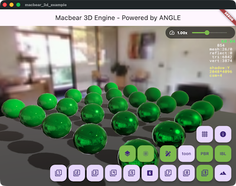

# Macbear 3D - OpenGL can, I will.

[English](README.md) | [繁體中文](README_zh.md)

[](https://pub.dev/packages/macbear_3d)
[](https://opensource.org/licenses/MIT)


**Macbear 3D** is a lightweight, high-performance 3D rendering engine for Flutter, powered by **Google ANGLE (OpenGL ES)**. It provides a simple yet powerful API to create stunning 3D experiences, games, and visualizations.

<p align="center">
  
  
</p>

### 🌐 [Live Web Demo](https://macbearchen.github.io/macbear_3d/)
Preview the `main_all.dart` example live in your browser!

## Key Features

### 🚀 Core Engine
- **Powered by ANGLE**: Direct OpenGL ES access via Google's ANGLE for high performance.
- **Scene Graph**: Flexible Entity-Component architecture and multi-camera support.
- **Resource Management**: Efficient centralized loading and caching for textures, meshes, and fonts.

### 🎨 Rendering & Visuals
- **Model Loaders**: Native support for **glTF/GLB** and **OBJ** formats.
- **Skeletal Animation**: Full support for skinned meshes and bone-based animations.
- **Advanced Lighting**: Dynamic lighting with **Cascaded Shadow Mapping (CSM)**, **PBR (Physically Based Rendering)** and **IBL (Image-Based Lighting)** support.
- **Terrain System**: Procedural terrain generation using Perlin Noise.
- **Text Rendering**: Generate 3D geometry from TrueType/OpenType fonts with alignment fixes for Web.

### ⚙️ Physics & Interaction
- **Integrated Physics**: Seamless integration with the **oimo_physics** rigid body physics engine.
- **Collision Detection**: Automatic AABB and Bounding Sphere calculation.
- **Touch Input**: Built-in interaction handling for 3D objects and orbit control.

<p align="center">
  
  
</p>

<details>
<summary>More Screenshots</summary>
<p align="center">
  
  
  
  
  
  
  
</p>
</details>

## Installation

Add `macbear_3d` to your `pubspec.yaml`:

```yaml
dependencies:
  macbear_3d: ^0.6.1
```

## Usage

Here is a simple example to display a 3D scene:

```dart
import 'dart:math';
import 'package:flutter/material.dart' hide Colors;
import 'package:macbear_3d/macbear_3d.dart';

void main() {
  M3AppEngine.instance.onDidInit = onDidInit;

  runApp(const MyApp());
}

Future<void> onDidInit() async {
  debugPrint('main_example.dart: onDidInit');
  await M3AppEngine.instance.setScene(MyScene());
}

class MyApp extends StatelessWidget {
  const MyApp({super.key});

  @override
  Widget build(BuildContext context) {
    return MaterialApp(
      home: Scaffold(
        appBar: AppBar(title: const Text('Macbear 3D Example')),
        body: const M3View(),
      ),
    );
  }
}

// Define a simple scene
class MyScene extends M3Scene {
  @override
  Future<void> load() async {
    if (isLoaded) return;
    await super.load();

    camera.setEuler(pi / 6, -pi / 6, 0, distance: 8);

    // add geometry
    addMesh(M3Mesh(M3BoxGeom(1.0, 1.0, 1.0)), Vector3.zero()).color = Colors.blue;
    addMesh(M3Mesh(M3SphereGeom(0.5)), Vector3(2, 0, 0)).color = Colors.red;
    addMesh(M3Mesh(M3TorusGeom(0.5, 0.3)), Vector3(0, 2, 0)).color = Colors.green;
    addMesh(M3Mesh(M3CylinderGeom(0.5, 0.0, 1.0)), Vector3(0, 0, 1)).color = Colors.yellow;
    addMesh(M3Mesh(M3PlaneGeom(5, 5)), Vector3(0, 0, -1));
  }
}
```

## Setup

To protect your usage, ensure you set `M3AppEngine.instance.onDidInit = onDidInit` and implement `onDidInit` method, then use `M3View` widget.

## Generate UML Diagram

https://pub.dev/packages/dcdg
```
./uml/gen_uml.sh
```
output to uml/macbear_3d.puml

## TODO

- [x] Skinned Mesh
- [x] Skeletal Animation
- [x] Shadows improvements (Cascaded Shadow Maps)
- [x] PBR Material support (Metallic, Roughness)
- [x] IBL (Image-Based Lighting)
- [x] Terrain System (Perlin Noise)
- [x] Skybox reflection via cubemap
- [ ] Water effect (reflection, refraction)
- [ ] Post-processing effects (Bloom, HDR)
- [ ] Advanced Particle System
- [x] Resource Management System
- [x] Text Rendering
- [x] GUI System (Use Flutter Widgets)
- [x] WebGL/Web support optimization (Text rendering alignment, platform abstraction)

## Contributing

Contributions are welcome! Please feel free to check the [issues](https://github.com/macbearchen/macbear_3d/issues) or submit a Pull Request.

## License

This project is licensed under the MIT License - see the [LICENSE](LICENSE) file for details.
