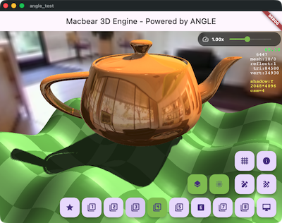

# 麥克熊 3D - OpenGL 能, 我來.

[English](README.md) | [繁體中文](README_zh.md)

[](https://pub.dev/packages/macbear_3d)
[](https://opensource.org/licenses/MIT)


**Macbear 3D** 是一個專為 Flutter 打造的輕量級、高性能 3D 渲染引擎，由 **Google ANGLE (OpenGL ES 3.0)** 驅動。它提供簡單且強大的 API，讓開發者能夠輕鬆創建驚艷的 3D 體驗、遊戲與視覺化應用。

<p align="center">
  
  
  
</p>

### 🌐 [線上即時演示](https://macbearchen.github.io/macbear_3d/)
在瀏覽器中直接預覽 `main_all.dart` 範例路徑！

## 主要特性

### 🚀 核心引擎
- **ANGLE 驅動**: 透過 Google ANGLE 直接整合 **OpenGL ES 3.0**，確保卓越性能。
- **場景圖 (Scene Graph)**: 靈活的實體-組件 (Entity-Component) 架構，支援多攝影機系統。
- **資源管理**: 預建的高效集中式加載與快取機制（紋理、模型、字體）。

### 🎨 渲染與視覺
- **模型加載**: 原生支援 **glTF/GLB**、**OBJ** 與 **BVH (骨架動畫)** 格式。
- **骨架動畫**: 完整支援皮膚網格 (Skinned Mesh) 與基於骨骼的動畫系統 (包含 `M3OctahedralGeom` 骨骼視覺化)。
- **進階光照**: 支援動態光照、**級聯陰影貼圖 (CSM)**、**PBR (實體渲染)** 與 **IBL (環境光照)**。
- **動態反射探針**: 加入 `M3ReflectionProbe` 實作即時環境捕捉與動態反射。
- **地形系統**: 使用 Perlin Noise 實現程序化地形生成。
- **3D 文字**: 支援從 TrueType/OpenType 字體直接生成 3D 文字幾何體，並修正 Web 端對齊問題。

### ⚙️ 物理與交互
- **整合物理引擎**: 與 **oimo_physics** 剛體物理引擎無縫協作。
- **碰撞檢測**: 自動計算 AABB 與包圍球 (Bounding Sphere)。
- **觸控輸入**: 內建 3D 物體互動處理與軌軌道攝影機 (Orbit Control) 支援。

## 安裝

在您的 `pubspec.yaml` 中加入 `macbear_3d`：

```yaml
dependencies:
  macbear_3d: ^0.7.1
```

## 快速上手

以下是一個顯示 3D 場景的簡單示例：

```dart
import 'dart:math';
import 'package:flutter/material.dart' hide Colors;
import 'package:macbear_3d/macbear_3d.dart';

void main() {
  M3AppEngine.instance.onDidInit = onDidInit;
  runApp(const MyApp());
}

Future<void> onDidInit() async {
  await M3AppEngine.instance.setScene(MyScene());
}

class MyApp extends StatelessWidget {
  const MyApp({super.key});

  @override
  Widget build(BuildContext context) {
    return const MaterialApp(
      home: Scaffold(
        body: M3View(),
      ),
    );
  }
}

class MyScene extends M3Scene {
  @override
  Future<void> load() async {
    if (isLoaded) return;
    await super.load();
    camera.setEuler(pi / 6, -pi / 6, 0, distance: 8);
    addMesh(M3Mesh(M3BoxGeom(1.0, 1.0, 1.0)), Vector3.zero()).color = Colors.blue;
  }
}
```

## TODO / 路線圖

- [x] 皮膚網格 (Skinned Mesh)
- [x] 骨架動畫 (Skeletal Animation)
- [x] 陰影優化 (級聯陰影貼圖 CSM)
- [x] PBR 材質支援 (金屬度、粗糙度)
- [x] IBL 環境光照 (Image-Based Lighting)
- [x] 地形系統 (Perlin Noise)
- [x] 天空盒反射 (Cubemap)
- [x] 動態反射探針 (Dynamic Reflection Probe)
- [ ] 水面效果 (反射、折射)
- [ ] 後處理特效 (Bloom, HDR)
- [ ] 進階粒子系統
- [x] GUI 系統 (使用 Flutter Widget)
- [x] WebGL/Web 支援優化 (文字對齊修正、平台抽象化)

## 參與貢獻

歡迎任何形式的貢獻！如果您發現 Bug 或有新功能建議，請隨時提交 [Issues](https://github.com/macbearchen/macbear_3d/issues) 或 Pull Request。

## 鳴謝 (Credits)

This motion capture data is licensed by mocapdata.com, Eyes, JAPAN Co. Ltd. under the Creative Commons Attribution 2.1 Japan License.
To view a copy of this license, contact mocapdata.com, Eyes, JAPAN Co. Ltd. or visit http://creativecommons.org/licenses/by/2.1/jp/ .
http://mocapdata.com/
(C) Copyright Eyes, JAPAN Co. Ltd. 2008-2009.

## 開源協議

本專案採用 MIT 協議授權 - 詳情請參閱 [LICENSE](LICENSE) 文件。
